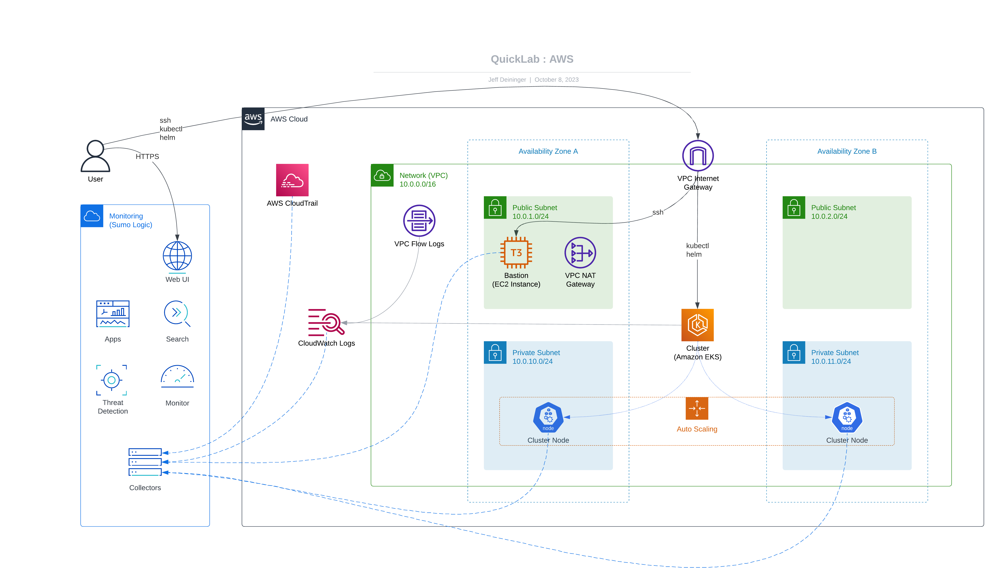

[comment]: # "This file is part of QuickLab, which creates simple, monitored labs."
[comment]: # "https://github.com/jeff-d/quicklab"
[comment]: #
[comment]: # "SPDX-FileCopyrightText: © 2023 Jeffrey M. Deininger <9385180+jeff-d@users.noreply.github.com>"
[comment]: # "SPDX-License-Identifier: AGPL-3.0-or-later"

# QuickLab

```
_______       _____      ______ ______        ______
__  __ \___  ____(_)________  /____  / ______ ___  /_
_  / / /  / / /_  /_  ___/_  //_/_  /  _  __ `/_  __ \
/ /_/ // /_/ /_  / / /__ _  ,<  _  /___/ /_/ /_  /_/ /
\___\_\\__,_/ /_/  \___/ /_/|_| /_____/\__,_/ /_.___/

Create simple, monitored labs.
```

QuickLab includes four components:

- a private network
- a bastion host
- a managed kubernetes cluster
- monitoring

QuickLab uses [Terraform](https://www.terraform.io/) to create its components in AWS, and uses [Sumo Logic](https://www.sumologic.com/) for monitoring.

QuickLab aims to enable builders and tinkerers by offering a ready-made playground that's "[well-architected](https://docs.aws.amazon.com/wellarchitected/latest/framework/welcome.html)" and flexible enough for a variety of projects.

QuickLab is designed to create lab _infrastructure_ only (and only the above-listed components). Once a QuickLab is created, users are free to deploy _applications_ or create additional lab resources.

## Use Cases

In no particular order:

- software development
- application and infrastructure deployment
- telemetry collection and analysis
- cybersecurity attack simulation (and detection) range

**Bonus:** Anything else you might think of! Once your network with bastion and/or cluster are created you can use them to create any number of scenarios that call for a VM or a kubernetes cluster!

## Diagram


_QuickLab on AWS, showing all components enabled, including the network (VPC), bastion (EC2 Instance), cluster (EKS) and monitoring (Sumo Logic)_

## Documentation

- [Requirements](docs/requirements.md)
- [Usage](docs/usage.md)
- [Components](docs/components.md)
- [About](docs/about.md)
