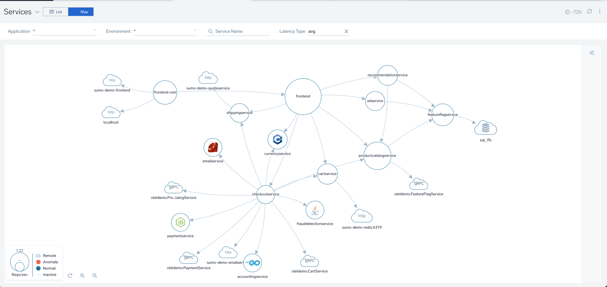
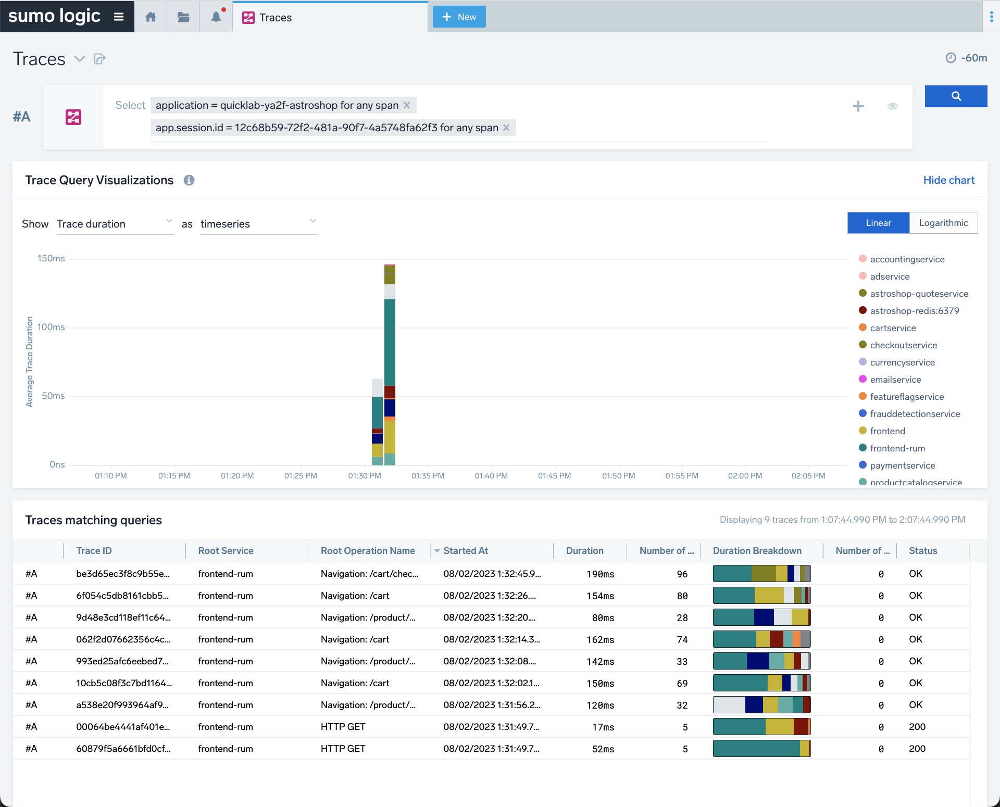

[comment]: # "This file is part of QuickLab, which creates simple, monitored labs."
[comment]: # "https://github.com/jeff-d/quicklab"
[comment]: #
[comment]: # "SPDX-FileCopyrightText: © 2023 Jeffrey M. Deininger <9385180+jeff-d@users.noreply.github.com>"
[comment]: # "SPDX-License-Identifier: AGPL-3.0-or-later"

# Sumo Logic Astronomy Shop


_Astronomy Shop demo app homepage_


_A Sumo Logic [Service Map](https://help.sumologic.com/docs/apm/traces/services-list-map/#services-map-view) showing the kubernetes-based Open Telemetry [demo app](https://opentelemetry.io/ecosystem/demo/)_

## TL;DR

- install AstronomyShop Components
  - use the included shell script (`astroshop.sh`) with the `-i` option
  - execute the script from the terraform project directory (e.g. `aws`)
  - example command:
    ```
    chmod +x modules/cluster/astroshop.sh && eval $(terraform output -raw cluster_kubeconfig) && ./modules/cluster/astroshop.sh -i
    ```
  - (optional) watch pods come up using another terminal window using command: `ns=app-astroshop && eval $(terraform output -raw cluster_kubeconfig) && kubectl -n $ns get pods --watch`
  - (optional) review helm release status using command `release=astroshop && ns=app-astroshop && helm status $release -n $ns`
  - (optional) review AstronomyShop kubernetes resources using command `ns=app-astroshop && kubectl -n $ns get all`
- [use the AstronomyShop](#use-app)
- uninstall AstronomyShop Components
  - use the included shell script (`astroshop.sh`) with the `-u` option
  - execute the script from the terraform project directory (e.g. `aws`)
  - example command:
    ```
    chmod +x modules/cluster/astroshop.sh && eval $(terraform output -raw cluster_kubeconfig) && ./modules/cluster/astroshop.sh -u
    ```

_Note: the installation script will also expose the AstronomyShop app publicly using an internet-facing load balancer._

---

## Manual Step-by-Step Walkthrough

### High-Level Process

- Prerequisites
- Create App
- Use App
- Clean Up

_Note: The example commands below assume execution from the terraform project directory (e.g. `aws`). Doing so, lets you reference terraform outputs by name, and use the file paths as written here._

### Prerequisites

- set kubernetes context to your QuickLab cluster

  - suggested approach: update your shell's $KUBECONFIG environment variable
  - example commannd: `eval $(terraform output -raw cluster_kubeconfig)`

- verify your kubernetes context with `kubectl cluster-info`

- set throwaway shell variables:

  ```
  lab=$(terraform output -raw _lab_id) \
  && release=astroshop \
  && ns=app-astroshop \
  && chart="modules/cluster/sumo-opentelemetry-demo/" \
  && printf "%s\n" "lab=$lab" "release=$release" "chart=$chart" "ns=$ns"
  ```

  _Note: Using the above shell variables will improve the readability of the commands used in the following steps._

### Create App

In this step, we will deploy the application to the QuickLab cluster and expose it publicly to the internet.

- create helm release

  - example command:
    ```
    helm upgrade -i $release $chart --atomic \
    --namespace $ns \
    --create-namespace
    ```

- watch application pods come up

  - use a different terminal window
  - execute commands from the terraform project directory (e.g. `aws`)
  - set [kubernetes context](#prerequisites)
  - set [throwaway shell vars](#prerequisites)
  - example command: `kubectl -n $ns get pods --watch`

  _Note: it is normal to see some `Error` and `CrashLoopBackOff` statuses while the deployment completes. All pods should be at `Running` status after 3 minutes._

- expose app publicly

  - create a Kubernetes Ingress for the `frontendproxy` service:
  - example command (`frontendproxy` service):

    ```
    now=$(date "+%M%S") \
    && kubectl -n $ns create ingress $release-frontend \
    --class='alb' \
    --rule="/*=$release-frontendproxy:8080" \
    --annotation alb.ingress.kubernetes.io/scheme=internet-facing \
    --annotation alb.ingress.kubernetes.io/target-type=ip \
    --annotation alb.ingress.kubernetes.io/load-balancer-name=k8s-$lab-$release-$now-frontend
    ```

- verify load balancer is `active`

  - use the included shell script
  - script uses [AWS CLI](requirements.md#cluster) commands
  - requires making the script executable before running
  - example command:

    ```
    chmod +x modules/cluster/lb.sh \
    && ./modules/cluster/lb.sh
    ```

    _Note: AWS Load Balancers can take ~3 minutes to become active._

### Use App

- buy some telescopes!

  - browese the app homepage
  - reference the `frontendproxy` service's load balancer URL
  - example command:
    ```
    app="http://$(kubectl -n $ns get ingress $release-frontend -o jsonpath='{.status.loadBalancer.ingress[0].hostname}')" \
    && open $app
    ```
    _Note: your user session id is at the bottom of the page, and can be found using a Sumo Logic trace query._

- view session trace

  - log in to Sumo Logic
  - click **+ New > Traces**
  - add two selectors to your trace query
    - traces for the astroshop application: `application = quicklab-<lab id>-astroshop for any span`
    - traces for your session id: `app.session.id = <my session id> for any span`
  - example trace query result:
    

- inject app fault conditions

  - use the included [feature flags](https://opentelemetry.io/docs/demo/feature-flags/)
  - example command: `open $app/feature/`

- simulate application load

  - use the included load generator service (based on [locust](https://locust.io/))
  - example command: `open $app/loadgen/`

  _Note: the Load Generator service simulates users requesting several different routes from the frontend by default._

- explore application

  - log in to Sumo Logic
  - click **+ New > Explore > Explore By > APM: Service View**

- explopre cluster

  - log in to Sumo Logic
  - click **+ New > Explore > Explore By > Kubernetes Service View**

- view cluster control-plane dashboards
  - log in to Sumo Logic
  - locate your [Personal Folder](https://help.sumologic.com/docs/get-started/library/#personal-folder) and select the subfolder for your QuickLab Lab Id.
  - click the "Amazon EKS Control Plane" folder and review the [dashboards](https://help.sumologic.com/docs/integrations/amazon-aws/eks-control-plane/#viewing-dashboards-for-amazon-eks---control-plane).

### Clean Up

- delete the Kubernetes Ingress for the `frontendproxy` service

  - example command: `kubectl -n $ns delete ingress $release-frontend`

    _Note: the [AWS Load Balancer Controller](https://kubernetes-sigs.github.io/aws-load-balancer-controller/v2.5/) will automatically remove each Ingress resource's associated Application Load Balancer._

- delete Helm release

  - example command: `helm delete $release --namespace $ns`

- watch the pods terminate

  - use a different terminal window
  - execute commands from the terraform project directory (e.g. `aws`)
  - set [kubernetes context](#prerequisites)
  - set [throwaway shell vars](#prerequisites)
  - example command: `kubectl -n $ns get pods --watch`

- delete the kubernetes namespace

  - once all pods are terminated
  - example command: `kubectl delete namespace $ns`

- delete the prometheus service from the `kube-system` namespace
  - determine if necessary first using command `kubectl -n kube-system get svc`
  - example command: `kubectl -n kube-system delete svc $release-kube-prometheus-kubelet`

## Troubleshooting

Some helpful commands that can be used to troubleshoot...

Helm

- list releases for all Namespaces: `helm list -A`
- check release status: `helm status $release -n $ns`
- inspect a chart: ` helm show chart <repo>/<chart>`
- list repos: `helm repo list`
- list charts in repo: `helm search repo <helm-repo-name>`
- get the chart notes for a release: `helm get notes $release --namespace $ns`
- test template rendering: `helm install $release $chart --namespace $ns --debug --dry-run`
- debug helm release install or upgrade: `helm upgrade -i $release $chart --namespace $ns --atomic --debug`
- helm chart template guide: [YAML techniques](https://helm.sh/docs/chart_template_guide/yaml_techniques/)

Kubernetes

- get names of running pods: `kubectl -n $ns get pods -o name --no-headers=true`
- force delete a pod: `kubectl -n $ns delete pod/prometheus-astroshop-kube-prometheus-prometheus-0 --force --grace-period 0`
- view pod events: `kubectl -n $ns describe pod/<pod-name>`
- get pod logs: `kubectl -n $ns logs <pod-name>`
- get namespaces: `kubectl get namespaces`
- get all the things: `kubectl get all -A`
- [kubectl reference](https://kubernetes.io/docs/reference/kubectl/)

Terraform

- refresh tf state: `terraform apply -refresh-only`
- see tf outputs: `terraform output`
- list resources in tf state: `terraform state list`
- see attributes of a single resource: `terraform state show '<resource.path>' `
- generate image of tf resources: `terraform graph | dot -Tsvg > graph.svg`
- [Terraform CLI Documentation](https://developer.hashicorp.com/terraform/cli)
- terraform internals: [Debugging Terraform](https://developer.hashicorp.com/terraform/internals/debugging)
  - blog: [How to trace terraform execution](https://sleeplessbeastie.eu/2021/02/05/how-to-trace-terraform-execution/)

## Documentation

- [Requirements](requirements.md)
- [Usage](usage.md)
- [Components](components.md)
- [About](about.md)
