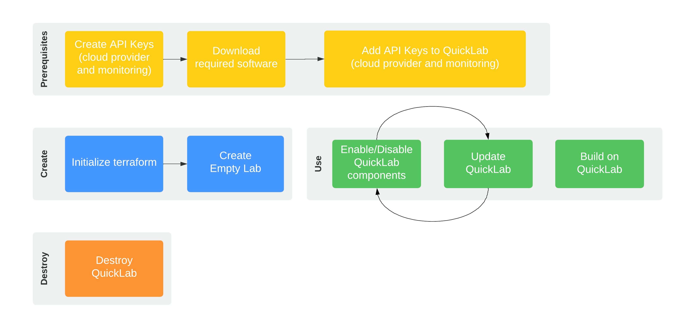

[comment]: # "This file is part of QuickLab, which creates simple, monitored labs."
[comment]: # "https://github.com/jeff-d/quicklab"
[comment]: #
[comment]: # "SPDX-FileCopyrightText: © 2023 Jeffrey M. Deininger <9385180+jeff-d@users.noreply.github.com>"
[comment]: # "SPDX-License-Identifier: AGPL-3.0-or-later"

# QuickLab Usage

## Lifecycle



## Walkthrough

### Prerequisites

- create API keys (for [cloud provider](requirements.md#general) and [monitoring](requirements.md#monitoring))
- download [required](requirements.md) software
- add API keys to QuickLab for monitoring
  - Edit `aws.auto.tfvars`. In the `Terraform providers` section, add Sumo Logic credentials.

_Notes:_

- _Terraform will automatically use your `default` aws cli profile to authenticate to AWS and select which Region to use, but you can optionally specify a different named aws cli profile and region._
- _Terraform can read your API keys from [environment variables](https://developer.hashicorp.com/terraform/language/values/variables#environment-variables)._

### Create

**This step validates you have met the prerequisites and is required before enabling QuickLab components.**

- Initialize terraform and create empty QuickLab using `terraform init && terraform apply -auto-approve`

  _Notes:_

  - _terraform must be initalized from a root module (e.g. `quicklab/aws`)_
  - _`terraform apply` can be used without `-auto-approve` to review the tf plan before terraform implements it._

### Use

Enable the QuickLab components needed for your use case, starting with the Network (which is required for the Bastion and Cluster). Disable QuickLab components when they are no longer needed.

- enable or disable a component

  - Edit `aws.auto.tfvars`. In the `Components` section, set `create_network` to `true` (or `false`).
  - Update QuickLab using `terraform apply -auto-approve` and review terraform output.

- build on QuickLab

  - use the [bastion](components.md#bastion) to securely access Windows or Linux servers in the Network's private subnets
  - use the [cluster](components.md#cluster) to deploy and use containerized microservice-based apps like the AstronomyShop OpenTelemetry-Demo application.
  - use Sumo Logic to analyze QuickLab component health, performance, cost, and security using out-of-box [solutions](monitoring.md#app-catalog-apps) with no configuration required
  - use Sumo Logic to implement OpenTelemetry-based telemetry collection for logs, metrics, and traces to an [Observability backend](https://opentelemetry.io/docs/what-is-opentelemetry/)

_Notes:_

- _QuickLab monitoring is enabled by selecting a supported monitoring backend (e.g. Sumo Logic, using `monitoring = "sumo"`)_
- _See a QuickLab inventory in the [AWS Console](https://console.aws.amazon.com/resource-groups/) using the `_lab_resource_group` named in the terraform output._
- _For typical QuickLab component create/destroy times, see [component notes](components.md#cycle-times)._
- _When building on QuickLab, remember that any resources you create or add will not be managed by QuickLab's terraform state. These resources should be removed prior to disabling any QuickLab component they depend on._

### Destroy

- destroy QuickLab

  - To remove all QuickLab components while maintaining the existing Lab Id, use:

    ```
    terraform apply \
    -auto-approve \
    -var="create_network=false" \
    -var="create_bastion=false" \
    -var="create_cluster=false" \
    -var="monitoring=none"
    ```

  - Use `terraform destroy` to reset the Lab Id and clear Terraform state.

    _Note: terraform [variables can be set](https://developer.hashicorp.com/terraform/language/values/variables#assigning-values-to-root-module-variables) for each run via cli argument_

## Documentation

- [Requirements](requirements.md)
- [Usage](usage.md)
- [Components](components.md)
- [About](about.md)
